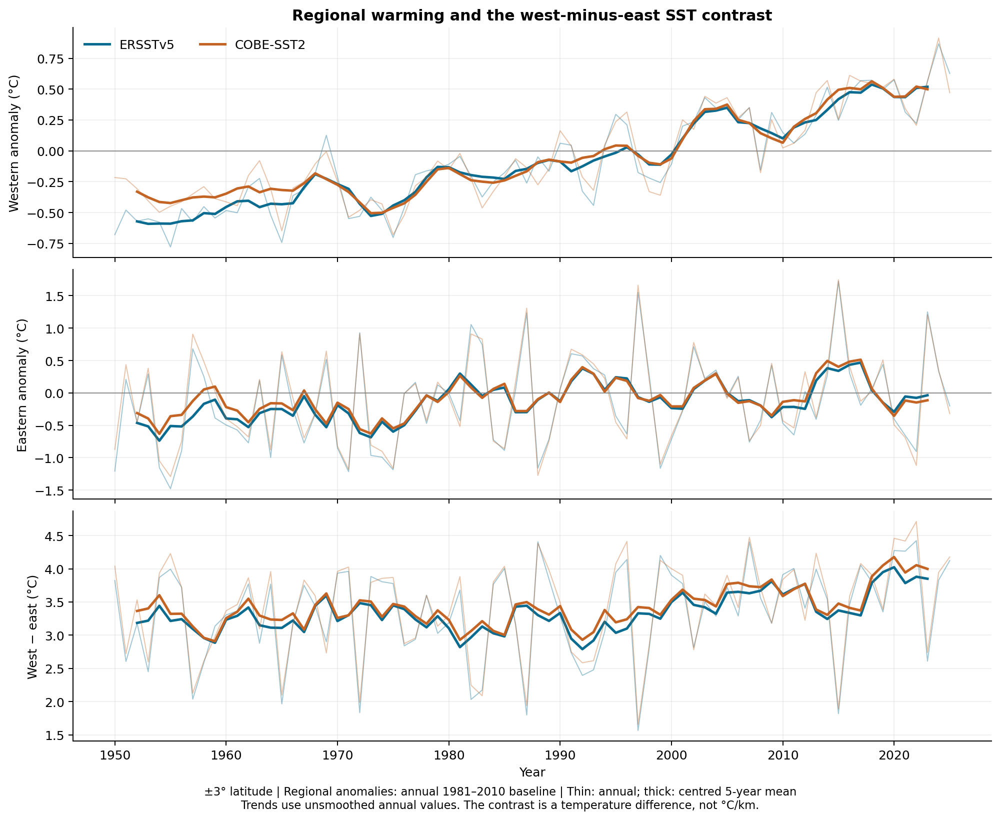
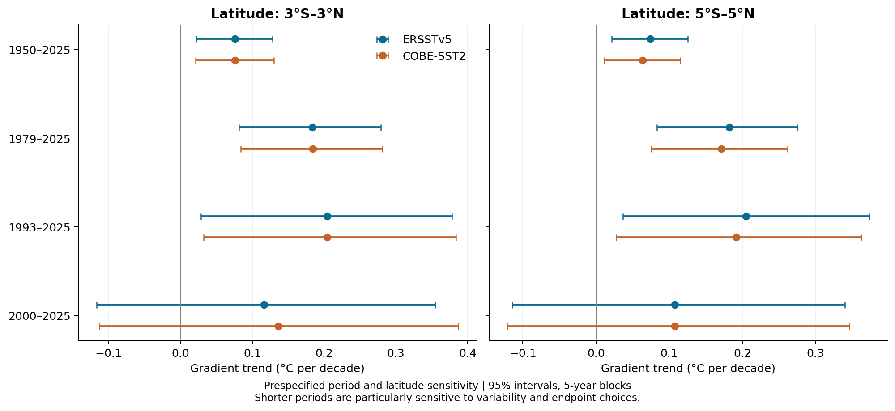

# Tropical Pacific SST gradient: observations and sensitivity

A reproducible Python analysis of the temperature contrast between the western and eastern equatorial Pacific, using **NOAA ERSSTv5** and **JMA COBE-SST2**, January 1950–December 2025.

**Question:** How has the west-minus-east sea-surface temperature (SST) contrast changed, and how sensitive is its linear trend to the observational product, analysis period, latitude band and treatment of temporal dependence?

This is a focused observational portfolio project. It demonstrates NetCDF handling, native-grid area averaging, temporal aggregation, trend estimation, reproducibility and scientific interpretation. It does not perform climate-model attribution or reproduce an entire published study.



## Results at a glance

Primary boxes: **140–170°E** and **190–270°E**, both **3°S–3°N**. Each box is averaged separately; the index is west minus east, in **°C**.

| Dataset | Period | Contrast trend, °C/decade | Conditional 95% interval |
|---|---|---:|---:|
| ERSSTv5 | 1950–2025 | +0.076 | +0.022 to +0.128 |
| COBE-SST2 | 1950–2025 | +0.076 | +0.021 to +0.130 |
| ERSSTv5 | 1979–2025 | +0.183 | +0.081 to +0.279 |
| COBE-SST2 | 1979–2025 | +0.184 | +0.084 to +0.281 |

Intervals use a circular moving-block bootstrap of detrended annual residuals: five-year blocks, 5,000 draws, fixed seed. They are conditional on these records and assumptions, not a complete observational uncertainty estimate.

- Over **1950–2025**, both boxes warm, with faster warming in the west. A strengthening contrast therefore does **not** mean that the eastern box cools.
- Over **1979–2025**, western warming is about 0.184–0.186°C/decade; eastern point estimates are close to zero, with wide intervals spanning warming and cooling.
- The **2000–2025** contrast estimates remain positive, but their primary bootstrap intervals include zero. A single trend does not describe every timescale equally well.
- The products give similar contrast trends, but share underlying observations. Their agreement is not independent replication.



Full results: [trend table](results/trends.csv), [computed summary](results/summary.md), [coverage checks](results/coverage.csv). Exact values are calculated from the bundled data; displayed values are rounded.

## Run it

Use Python **3.11 or newer**. The pinned environment was executed with the versions recorded in [run_manifest.json](results/run_manifest.json).

```bash
python -m venv .venv
```

Activate the environment:

```bash
# macOS / Linux
source .venv/bin/activate
# Windows PowerShell (use this instead)
.venv\Scripts\Activate.ps1
```

Then run from the repository folder:

```bash
python -m pip install -r requirements.txt
python scripts/download_data.py
python -m unittest discover -s tests -v
python scripts/run_analysis.py
python scripts/execute_notebook.py
```

The notebook was executed in this build with `python scripts/execute_notebook.py --in-process`, using IPython because kernel sockets are unavailable in the build environment. The same option is available if your environment restricts local sockets; on a normal computer, the command above launches a Jupyter kernel. Both modes execute the actual code cells.

The first data command **verifies the included snapshot** using SHA-256 checksums; it requires no network. The roughly 9 MB of NetCDF subsets are intentionally included so the results remain reproducible if live provider files change. Analysis after dependency installation runs offline.

To deliberately replace the snapshot with current provider files:

```bash
python scripts/download_data.py --refresh
python scripts/run_analysis.py
python scripts/execute_notebook.py
```

Refresh changes the provenance manifest and may change results. Review numerical statements in this README after refreshing or changing `config.json`. The download service must be available for refresh.

## Read and explore

- [Executed notebook](notebooks/pacific_sst_gradient.ipynb): step-by-step workflow, intermediate calculations, results and figures. GitHub can display saved outputs without running Python.
- [Methods](docs/METHODS.md): equations, assumptions, uncertainty and limitations.
- [Data sources and references](DATA_SOURCES.md): citations, versions and access details.

The central calculations are in `src/sst_gradient.py`. Settings are in `config.json`. Generated tables and plots are retained for review. Figures are supplied as PNG and vector PDF.

## Scientific scope

The published box definition is drawn from Byrne, Seager and Smerdon, *Nature Communications* 17, 142, [doi:10.1038/s41467-025-66839-w](https://doi.org/10.1038/s41467-025-66839-w). This project uses a different period, only two observational products and its own documented averaging and bootstrap workflow. It does not test that paper's model-based conclusions.

ERSSTv5 is deliberately retained for comparability with that literature; it is **not the latest ERSST release**. Adding ERSSTv6, an additional product, wind stress or upper-ocean diagnostics would be useful extensions. Such extensions have not been performed here.

No affiliation with or endorsement by UiB, NOAA or JMA is implied.

## Data acknowledgment and license

SST products were obtained through NOAA Physical Sciences Laboratory, Boulder, Colorado, USA: [psl.noaa.gov](https://psl.noaa.gov/). ERSSTv5 is produced by NOAA; COBE-SST2 by JMA. Original data provenance remains in the NetCDF files and manifest.

The [MIT license](LICENSE) covers repository code and original documentation. It does not replace the providers' terms or grant ownership of their data. See [DATA_SOURCES.md](DATA_SOURCES.md).
